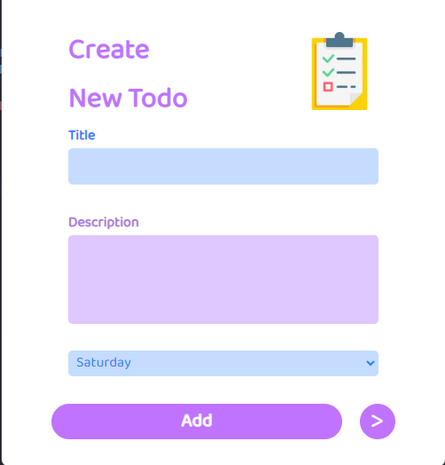
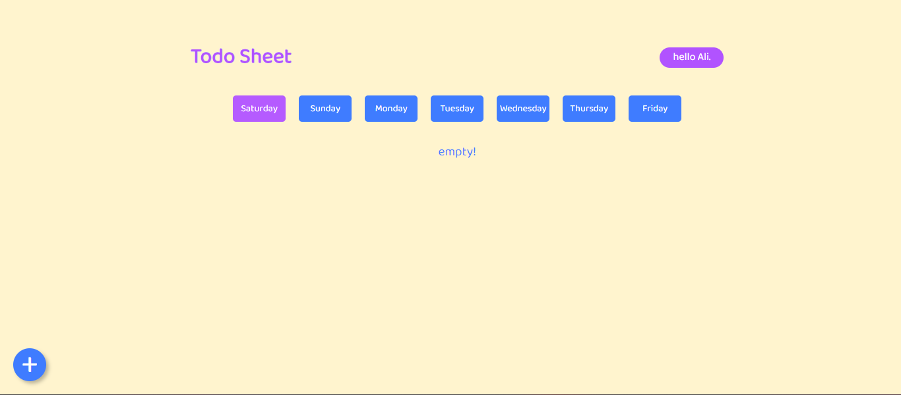
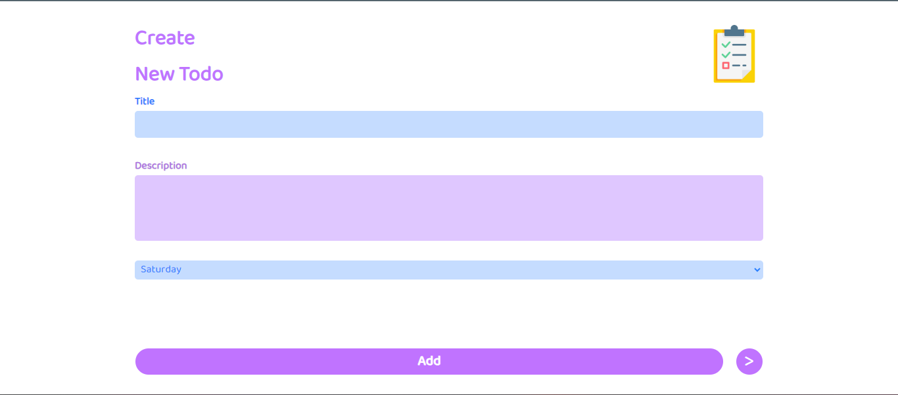

# Toma
a Todo manager for everyone

## skills
- Vue.js
- Google Fonts
- Web Cookies

## description
This is a todo manager written in Vue.js that saves and displays your todos in the browser by registering them. You can create and delete your todos.

## images

## online demo
you can see this project on its [online demo](https://todman.netlify.app)